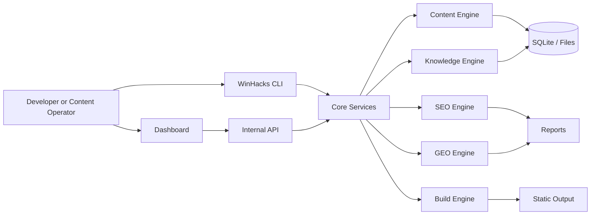

# WinHacks OS Developer Journey

> **Learn. Build. Document. Share.**

WinHacks OS Developer Journey is the engineering repository for building the next generation of the WinHacks platform while documenting the complete path from an existing JavaScript toolkit to a modular, tested, production-ready Full Stack system.

The public WinHacks website remains separate and stable. This repository is the controlled environment where the platform is studied, redesigned, tested, and modernized.

## Project status


**Current milestone:** Foundation and development environment  
**Current focus:** Repository setup, architecture baseline, and legacy-engine inventory

## Why this project exists

WinHacks already has useful tools for static builds, RSS, sitemaps, SEO, GEO, content workflows, CMS operations, performance analysis, and knowledge management. Those tools grew inside the production website and now need a safer environment for learning, refactoring, and long-term development.

This repository solves three problems:

1. It protects the production WinHacks website from experimental changes.
2. It creates a professional engineering path for modernizing the existing toolset.
3. It documents the learning process so the work can later support WinHacks Academy, technical articles, videos, and a developer portfolio.

## What we are building

WinHacks OS is planned as a modular platform with these domains:

- **Core Engine** — configuration, filesystem operations, validation, logging, and shared services.
- **CLI** — one command-line entry point for WinHacks workflows.
- **Content Engine** — drafts, publishing, templates, content metadata, and pipelines.
- **SEO Engine** — technical audits, metadata validation, internal links, and reports.
- **GEO Engine** — AI-answer readiness, entity coverage, structured content, and citations.
- **Build Engine** — static generation, RSS, sitemap, search index, and reusable components.
- **Knowledge Engine** — structured knowledge, schemas, validation, and retrieval.
- **Dashboard** — a future interface for running tools and reviewing results.
- **Automation** — repeatable workflows, checks, releases, and scheduled operations.

## Architecture direction



This is a target architecture, not a claim that every component is already implemented.

## Repository structure

```text
.
├── apps/                    # User-facing applications
│   └── dashboard/           # Future web dashboard
├── packages/                # Reusable platform packages
│   ├── core/                # Shared types and core services
│   └── cli/                 # Command-line interface
├── docs/                    # Product, architecture, development, and learning docs
├── engineering-log/         # Session-by-session engineering record
├── labs/                    # Guided practical work
├── legacy/                  # Controlled copy of selected existing engine code
├── resources/               # Verified learning resources
├── scripts/                 # Repository maintenance scripts
└── tests/                   # Repository-level tests
```

## Technology direction

| Technology | Planned role |
|---|---|
| Node.js 22+ | Runtime for tooling, automation, and server-side services |
| TypeScript | Type safety and maintainable package contracts |
| React | Reusable dashboard interface |
| Next.js | Future Full Stack application and internal API |
| Tailwind CSS | Dashboard UI system |
| SQLite | Simple local persistence for the first production-capable version |
| Vitest | Unit and integration testing |
| GitHub Actions | Automated validation and continuous integration |

Technologies are introduced only when the project reaches the problem they solve.

## Getting started

### Requirements

- Git
- Node.js 22 or newer
- npm
- Visual Studio Code or another code editor

### Install

```bash
git clone <YOUR-REPOSITORY-URL>
cd WinHacks-OS-Developer-Journey
npm install
```

### Validate the repository

```bash
npm run check
```

### Run the current CLI placeholder

```bash
npm run dev:cli
```

### Build all packages

```bash
npm run build
```

## Development workflow

1. Select one issue or lab.
2. Create a focused branch.
3. Make the smallest useful change.
4. Run validation locally.
5. Update documentation when behavior changes.
6. Record the session in the engineering log.
7. Commit using Conventional Commits.

Example:

```bash
git checkout -b chore/foundation-validation
npm run check
git add .
git commit -m "chore: establish repository foundation"
```

## Learning journey

The learning path is project-driven:

1. Development environment
2. Git and GitHub
3. JavaScript foundations
4. Node.js foundations
5. TypeScript
6. Testing
7. React
8. Next.js
9. Tailwind CSS
10. SQLite and data modeling
11. REST APIs
12. Architecture and production release

See [Developer Roadmap](Developer-Roadmap.md) and [Learning Guide](Learning-Guide.md).

## Documentation

- [Project Charter](docs/product/PROJECT_CHARTER.md)
- [Product Requirements](docs/product/PRD.md)
- [Architecture Overview](docs/architecture/overview.md)
- [Local Setup](docs/getting-started/local-setup.md)
- [Development Workflow](docs/development/workflow.md)
- [Learning Guide](Learning-Guide.md)
- [Developer Roadmap](Developer-Roadmap.md)
- [Legacy Migration Strategy](docs/architecture/legacy-migration.md)
- [Engineering Principles](docs/development/engineering-principles.md)

## Roadmap

| Version | Milestone | Status |
|---|---|---|
| 0.4 | Professional repository foundation | Current |
| 0.5 | Working Node.js and TypeScript CLI | Planned |
| 0.6 | Core package and configuration service | Planned |
| 0.7 | First migrated engine module | Planned |
| 0.8 | Tests, reports, and internal API baseline | Planned |
| 0.9 | Dashboard integration | Planned |
| 1.0 | Stable WinHacks OS release | Planned |

See [ROADMAP.md](ROADMAP.md) for acceptance criteria.

## Legacy code policy

The selected code under `legacy/winhacks-engine/` is reference material copied from the existing WinHacks project. It is not automatically considered production-ready in this repository.

Every migrated module must be:

1. Inventoried.
2. Understood.
3. Documented.
4. Covered by tests.
5. Refactored behind a clear interface.
6. Integrated without modifying the public WinHacks repository.

## Contributing

Read [CONTRIBUTING.md](CONTRIBUTING.md) before opening a pull request. Issues should have a clear goal and measurable acceptance criteria.

## Security

Do not publish credentials, tokens, private customer information, or production secrets. See [SECURITY.md](SECURITY.md).

## License

This repository is licensed under the [MIT License](LICENSE), except for third-party material or legacy assets that explicitly state a different license.

## Author

**Clent Ebanks**  
Founder of WinHacks  
Building technology that explains Windows clearly for real people.
