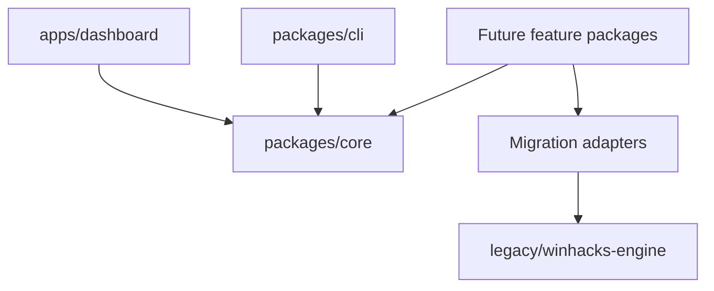

# Architecture Overview

## Current phase

The repository is in the foundation phase. The architecture below defines direction and module boundaries; it does not imply that all components exist.

## Boundaries

- `packages/core`: shared, dependency-light services.
- `packages/cli`: terminal interface.
- `apps/dashboard`: future browser interface.
- `legacy/winhacks-engine`: selected reference code from the existing project.
- `docs`: product and engineering knowledge.
- `scripts`: maintenance tasks for this repository.

## Dependency rule

Applications may depend on packages. Feature packages may depend on core. Core must not depend on applications, user interfaces, or legacy code.

## Data direction

SQLite is planned for structured state. Files remain appropriate for source content, templates, exported reports, and compatibility with the current WinHacks workflow.
